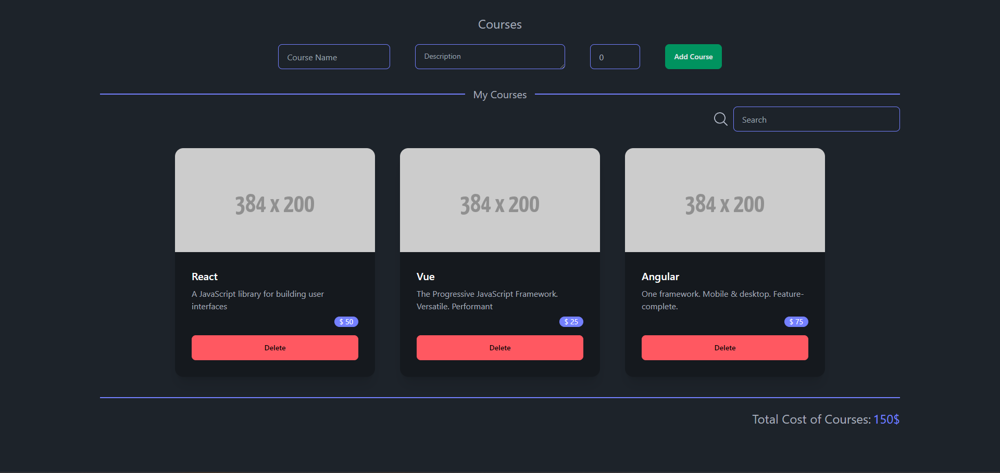
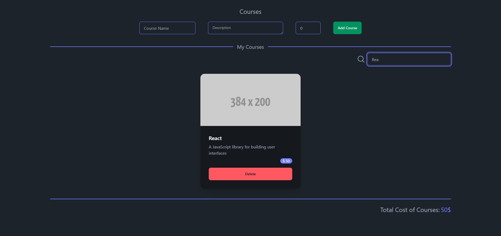

# Course App

This project is a Course App built using React, Redux Toolkit, TailwindCSS, and DaisyUI. The main purpose of this project is to showcase my skills in React and Redux Toolkit.

## Why I Created This Project?

The Course App was created with the goal of demonstrating proficiency in React and Redux Toolkit. By building a Course App, I aimed to showcase my ability to architect a React application, manage state with Redux Toolkit, and implement a responsive and visually appealing user interface with TailwindCSS and DaisyUI.

## Technologies Used

The technologies utilized in this project include:

- **React:** A JavaScript library for building user interfaces.

- **Redux Toolkit:** A set of tools to manage state in a predictable way, commonly used with React applications.

- **TailwindCSS:** A utility-first CSS framework that facilitates rapid and efficient styling.

- **DaisyUI:** A UI component library for TailwindCSS, providing pre-designed components for easy integration.

## Lessons Learned

Throughout the development of this project, several key lessons were learned:

- **Effective State Management:** I gained hands-on experience in managing application state efficiently using Redux Toolkit. This includes the creation of multiple slices to organize and modularize the state.

- **Responsive UI Design:** The project provided an opportunity to enhance my skills in responsive web design using TailwindCSS and DaisyUI. Creating a visually consistent and user-friendly interface across different devices was a significant learning point.

- **Component-Based Architecture:** I focused on creating a modular and reusable component-based architecture. This approach promotes code reusability, maintainability, and scalability.

## Screenshots

## Getting Started

To get started with the Course App, follow these steps:

1. Clone the repository: `git clone https://github.com/burakkduran/quiz-app`
2. Install dependencies: `npm install`
3. Run the application: `npm run dev`

Feel free to explore the codebase and customize the app according to your preferences.
